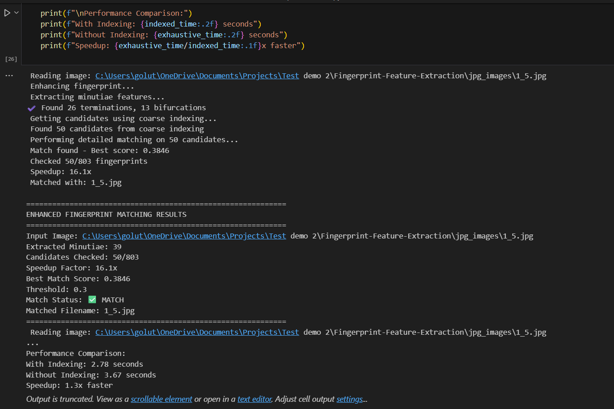

# Fingerprint Feature Extraction and Matching System

This project implements a fingerprint identification system using **coarse indexing** and **minutiae feature extraction**. It is designed for large-scale fingerprint databases, speed improvement over exhaustive search methods.

---





## Features

- **Minutiae Extraction**  
  Detects terminations and bifurcations using skeletonization and region labeling.

- **Angle Computation**  
  Computes orientation of each minutia for robust matching.

- **Spurious Minutiae Removal**  
  Eliminates closely spaced or duplicate minutiae points to improve accuracy.

- **Coarse Indexing**  
  Accelerates search using:
  - Global ridge flow classification
  - Minutiae distribution clustering
  - Local hash buckets
  - K-Means clustering on feature vectors

- **MongoDB Integration**  
  Stores minutiae features and index data for scalable matching.

---

## Project Structure

```
Fingerprint-Feature-Extraction/
│
├── main.ipynb                  # Jupyter notebook for full pipeline and testing
├── fingerprint_feature_extractor/
│   └── __init__.py             # Minutiae extraction logic
├── requirements.txt            # Python dependencies
├── result.png                  # Sample result (if saveResult=True)
├── fingerprint_index_models.pkl # Saved clustering models
└── README.md                   # Project documentation
```

---

## Installation

### 1. Clone the Repository

```bash
git clone https://github.com/your-username/Fingerprint-Feature-Extraction.git
cd Fingerprint-Feature-Extraction
```

### 2. Create Virtual Environment (Optional)

```bash
python -m venv venv
source venv/bin/activate  # or venv\Scripts\activate on Windows
```

### 3. Install Dependencies

```bash
pip install -r requirements.txt
```

---

## Usage

### 1. Extract Minutiae from an Image

```python
from fingerprint_feature_extractor import extract_minutiae_features
import cv2

image = cv2.imread("sample.png", 0)
features_term, features_bif = extract_minutiae_features(image, showResult=True)
```

### 2. Run Full Indexing & Matching (via Notebook)

Open `main.ipynb` in Jupyter and follow the steps:
- Enhance fingerprint
- Extract features
- Build index
- Match query fingerprint

---

## Dependencies

- numpy
- opencv-python
- scikit-image
- scikit-learn
- pymongo
- fingerprint-enhancer (custom or third-party)

Install all with:

```bash
pip install -r requirements.txt
```

---

## Performance

- Time complexity (feature extraction): **O(h × w + n²)**  
- Search complexity reduced from **O(m × n²)** to **O(c × n²)** where `c << m`

---

## Notes

- The project uses MongoDB running locally at `mongodb://localhost:27017/`
- Compatible with grayscale fingerprint images (8-bit)
- Tested on Python 3.8+

---

## License

MIT License. Feel free to use and modify the code.

---

## Acknowledgments

- Based on standard practices in biometric systems
- Skeletonization and convex hull algorithms via `scikit-image`
